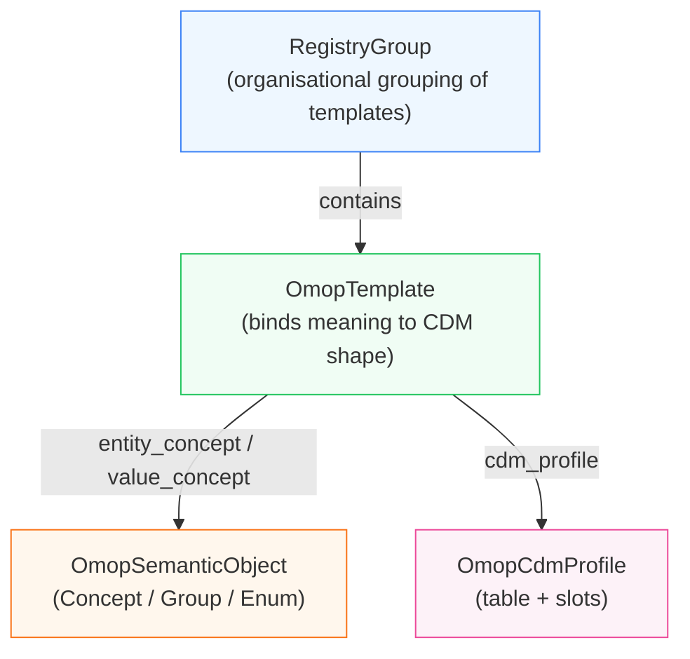

# OMOP_Semantic

omop_semantics is a lightweight, schema-backed registry for defining and managing semantic OMOP conventions. 

It provides a small, explicit layer for defining, validating, grouping, and traversing OMOP concept identifier and grouping for use in clinical modelling, phenotyping, staging systems, modifiers, and domain-specific semantics.

This creates a validatable, versionable source that can integrate with ETL pipelines, data quality checks, and documentation generation systems, ensuring all of these convention-defining systems are guaranteed to be in sync.

## What problem this solves

A core design goal is to support opinionated, use-case–specific schemas. Rather than assuming a single “correct” interpretation of the OMOP CDM, omop_semantics allows you to define and validate different convention profiles depending on context. This makes it possible to express constraints and semantics that are meaningful in one analytical setting but inappropriate or overly restrictive in another.

For example, the OMOP CONDITION_OCCURRENCE table permits any standard concept from the condition domain. However, when working within an oncology-specific modelling context, additional semantic conventions often apply e.g how staging concepts and modifiers should be linked to malignant conditions, or which subsets of condition concepts are valid for tumour phenotyping. These oncology-specific conventions are not intrinsic to OMOP itself and are not generally applicable outside that domain. omop_semantics provides a structured way to encode, validate, and reason over these kinds of domain-specific conventions without baking them into the underlying CDM.

In this sense, it is designed to act as a semantic control layer over OMOP: project-scoped, explicit, and explainable, while remaining portable and independent of the database or vocabulary services.

* Human-authored – concepts and groups are defined into roles and classes within LinkML schemas, which can be navigated to understand the explicit and inspectable semantic relationships
* Portable – no database or graph store required
* Versionable – definitions can be traced over time as conventions adapt to the needs of real-world data
* Flexible integrations - can be used to produce simple sql definitions, human-readable documentation, and OMOP-alchemy compatible vocabulary lookups

## Core design

| Layer                          | What it is                                              | Examples                                        |
| ------------------------------ | ------------------------------------------------------- | ----------------------------------------------- |
| **A. Semantic primitives**     | What does this concept *mean* in OMOP terms?            | `OmopConcept`, `OmopGroup`, `OmopEnum`          |
| **B. Structural templates**    | How does this semantic thing get written into CDM rows? | `OmopTemplate`                                  |
| **C. Registry / organisation** | How do we group and publish reusable definitions?       | `RegistryFragment`, `RegistryGroup`             |
| **D. CDM profiles**            | What *shape* of CDM row are we writing?                 | `observation_coded`, `measurement_numeric`, etc |



* OmopConcept   → atomic OMOP concept_id
* OmopGroup     → semantic sets of concepts
* OmopTemplate  → how concepts are composed into CDM rows

At a high level, omop_semantics does four things:

1. Loads a LinkML schema

This defines:

* Valid semantic roles & their definitions (e.g. staging, modifier, demographic)
* Expected classes (e.g. OmopConcept, ConceptGroup)

2. Loads YAML instance files

These define:

* Individual OMOP concepts with semantic roles and optional parents
* Named groups of concepts (e.g. “DemographyConcepts”, “TStage”)

3. Builds a runtime ConceptRegistry

The registry provides:

* Fast lookup by concept_id and role
* Group membership queries
* Semantic parent/ancestor traversal
* Validation against the schema

4. Supports round-tripping

The registry can be emitted back to LinkML-compatible YAML, enabling:

* Curation workflows
* Version control of semantic registries
* Programmatic transformation and merging

## Typical Usage

```python

from omop_semantics.utils.load import load

registry = load(
    schema_paths=["omop_semantic_core.yaml", "staging.yaml"],
    instance_paths=["demographic.yaml", "staging_instances.yaml"],
)

registry.by_role("demographic")
registry.ancestors_of(1634213)  # e.g. T0 → staging parents
registry.group_members("TStage")

```
